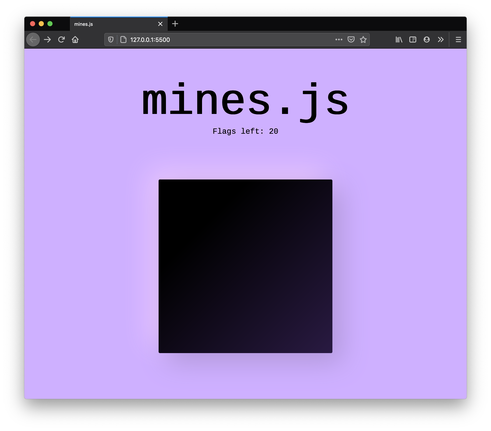

# mines.js

A simple, modern game of minesweeper built using vanilla JavaScript.

## How to play

You are presented with a board of squares. Some squares contain mines (bombs), others don't. If you click on a square containing a bomb, you lose. If you manage to click all the squares (while flagging all bombs by right clicking them) you win.

Clicking a square which doesn't have a bomb reveals the number of neighbouring squares containing bombs. Use this information plus some guess work to avoid the bombs.

To open a square, point at the square and click on it. To mark a square you think is a bomb, point and right-click (or hover with the mouse and press Space).
